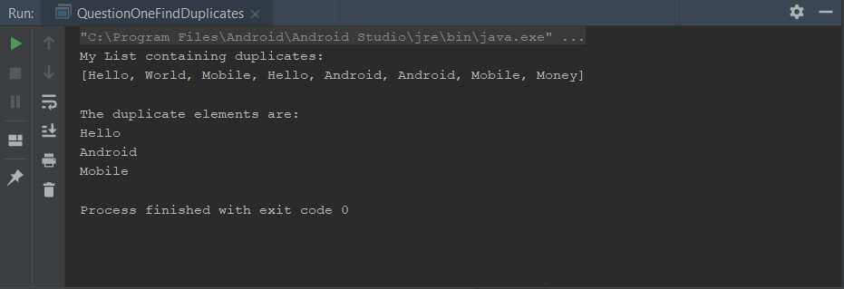
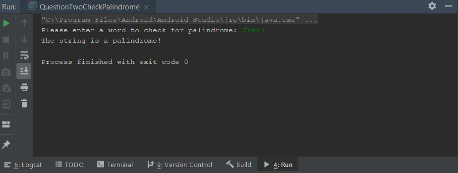
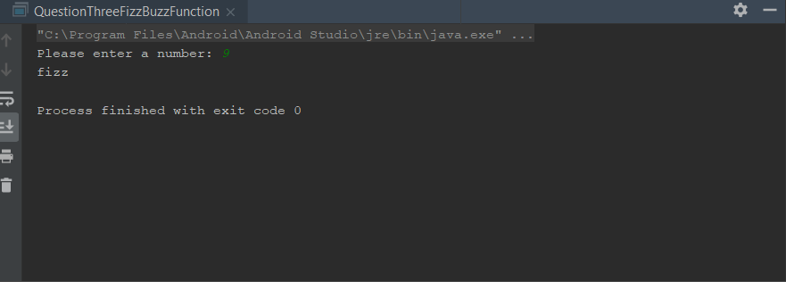
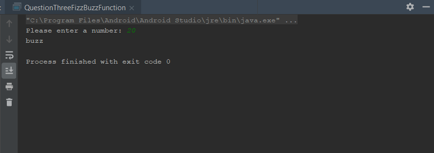
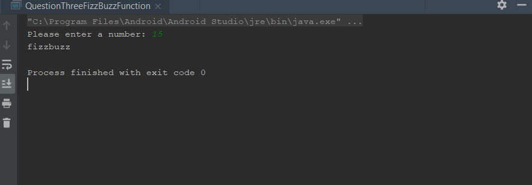

# Week2Daily2
Week 2 Daily 2 - Java Review

The Homework Part 1: Research word file is uploaded into the repository's root as: Week1Daily2 - JavaResearch.docx.

The Homework Part 2: Coding

Question 1: Find Duplicates is located in the path listed below:
app/src/main/java/com/example/week1daily2/QuestionOneFindDuplicates.java

Assignment:
Create a function to print the duplicates in a list of strings. public void findDuplicates(List<String> strings){};

Instructions:
- Run QuestionOneFindDuplicates.java main() method

Question 2: Check Palindrome is located in the path listed below:
app/src/main/java/com/example/week1daily2/QuestionTwoCheckPalindrome.java

Assignment: 
Create function to check if the string is a palindrome without using string.reverse() method. public boolean checkPalindrome(String word){};

Instructions:
- Run QuestionTwoCheckPalindrome.java main() method
- The program will ask you to enter a word to check for palindrome
- Enter Civic for input to check for palindrome
- The program displays that the String is a Palindrome

Question 3: FizzBuzz Function is located in the path listed below:
app/src/main/java/com/example/week1daily2/QuestionThreeFizzBuzzFunction.java

Assignment:
Create a function that will print:
     "fizz" is the number is divisible by 3, 
     "buzz" is the number is divisible by 5, 
     "fizzbuzz" is the number is divisible by both.

Instructions:
- Run QuestionThreeFizzBuzzFunction.java main() method
- The program will ask the user to enter a number
- It displays output fizz, buzz, or fizzbuzz

